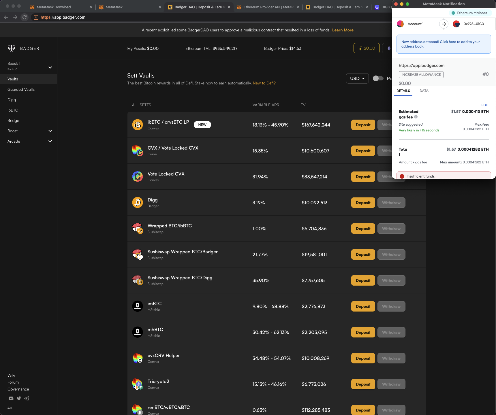
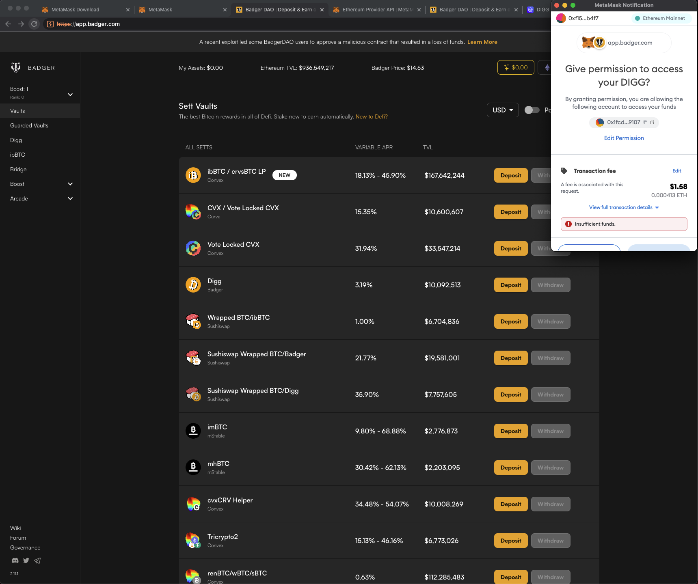

# BadgerDAO Malicious Script

## Overview
On the 03-12-2021 there was an attack on the [BadgerDAO](https://app.badger.com/) website that led to ~120$M being stolen by some attacker.

More details about the attack in our blogpost [here](https://zengo.com/the-badgerdao-hack-what-really-happened-and-why-it-matters/).

We decided to analyze the malicious code (found [here](https://web.archive.org/web/20211129204203/https://app.badger.com/)) that was injected into the site.

The code was originally obfuscated (`badger-dao-malicious-script-raw.js`), we then beautified it using `replace_strings.py` and some manual work.
Final readable version in `badger-dao.html`.

We did this by reinjecting the code into the live version of the app using Burp.

An interesting thing that the code does is use `increaseAllowance` instead of `approve` when interacting with a different vault than the one the attacker wants access to.

The reason for this is the way Metamask shows those transactions, the screenshots below demonstrate it well. Metamask doesn't tell you it's an approval operation, nor the ERC20 Token name when dealing with `increaseAllowance`, this makes it less suspicious to the user.

## Flow
The following analysis is based on the beautified code in `badger-dao.html` .
- Check for Metamask and ethereum object existence
- Check the wallet is on Ethereum mainnet
- Hook the `ethereum.request` and modify it:
- Wait for an `eth_sendTransaction` request - used to send a transaction to the MM wallet
- Looks for 1 of two contract function sig:
    - 0xb16eb351 - `claim(address[],uint256[],uint256,uint256,bytes32[],uint256[])`
    - 0x2e1a7d4d - `withdraw(uint256)`

- Checks that the wallet owner isn't one of the "admins" - dev wallets for badger
- Checks the victim has more than $50k in their vaults
- Also doesn't check for a minimum balance for this address: `0x38b8F6af1D55CAa0676F1cbB33b344d8122535C2`
    - [https://etherscan.io/txs?a=0x38b8f6af1d55caa0676f1cbb33b344d8122535c2](https://etherscan.io/txs?a=0x38b8f6af1d55caa0676f1cbb33b344d8122535c2)
    - Set up in 2021-10-22
    - Looks like the attacker's test account for the attack
- Then for every vault:
- Check if there is an allowance for the attacker to take from the victim
- If Not:
    - Find vault with largest balance
    - If the user tries to withdraw/claim from a different vault, send `increaseAllowance`
    - If the user tries to withdraw from the `maxVault` then send an `approve` (if there is no allowance yet)
    - Saves whether the `increaseAllowance`/`approve` was approved by the wallet or denied and won't ask again (until the page is refreshed).
- If there is already an allowance:
    - Will never ask for one
    

## Screenshots

- Clicking withdraw on a vault other than the maxVault (which was Digg):
    
    
    
- Clicking withdraw on the maxVault (Digg):
    
    
